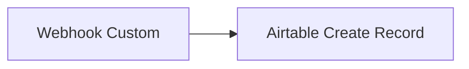

# Sondage Agiloshield 2026 — Configuration Airtable + Make

Table : **[Sondage_Agiloshield_2026](https://airtable.com/appXRsk0Ra4iVVgu2/tblKcJaAmy9RZPMU3/viw3wsneqDTiDuxH6?blocks=hide)**  
Base : `[CMS_Agilotext]` (`appXRsk0Ra4iVVgu2`)  
ID table : `tblKcJaAmy9RZPMU3`

---

## 1. Schéma des champs (à configurer dans l’UI Airtable)

L’API ne permet pas de créer des colonnes automatiquement. Vérifie que ta table contient **exactement** ces champs :

| Champ | Type Airtable | Obligatoire | Description |
|-------|---------------|-------------|-------------|
| `Fonctionnalites` | **Multiple select** | Oui | Les choix cochés par l’utilisateur (voir options ci-dessous) |
| `Email` | Email | Non | Email facultatif du répondant |
| `Date_reponse` | Date | Non | Date de soumission (format ISO `YYYY-MM-DD` depuis Make) |
| `Source` | URL (ou Texte sur une ligne) | Non | URL de la page Webflow |
| `Autre_precision` | Texte long | Non | Précision si « Autre » est coché |
| `Notes` | Texte long | Non | Usage interne (optionnel, laisser vide) |

**Supprimer** le champ `Assignee` s’il est encore présent (héritage template).

### Options du Multiple select `Fonctionnalites`

Copier-coller ces libellés **à l’identique** (le formulaire envoie ces chaînes exactes) :

1. `Logiciel installé sur mon ordinateur`
2. `Intégration Claude / ChatGPT`
3. `Traitement en lot de dossiers entiers`
4. `Plugin Word / Excel`
5. `Rapport de conformité RGPD`
6. `API / automatisation`
7. `Autre`

**Transformation depuis l’existant :** si `Fonctionnalites` est encore en « Texte sur une ligne », modifier le type en « Sélection multiple » et ajouter les 7 options ci-dessus.

---

## 2. Vue analytics (recommandée)

Dans Airtable, dupliquer la grille et :

- **Grouper par** : `Fonctionnalites`
- **Trier par** : `Date_reponse` (décroissant)
- **Masquer** : `Notes`, `Assignee` (si conservé)

Pour un décompte rapide : extension « Chart » ou export CSV + tableau croisé.

---

## 3. Scénario Make.com

**Blueprint prêt à importer :** [`BLUEPRINT_MAKE_SONDAGE_AGILOSHIELD_2026.json`](BLUEPRINT_MAKE_SONDAGE_AGILOSHIELD_2026.json)  
Webhook : **FORMULAIRE_AGILOSHIELD** (hook `3121074`, zone **eu1**).



### Import Make

1. Make → Scénarios → **Import blueprint** → fichier `BLUEPRINT_MAKE_SONDAGE_AGILOSHIELD_2026.json`
2. Vérifier le module Webhook : hook **FORMULAIRE_AGILOSHIELD**
3. Copier l’**URL du webhook** (format `https://hook.eu1.make.com/…`)
4. Activer le scénario

### Mapping Airtable (déjà dans le blueprint)

| Champ Airtable | ID champ | Valeur Make |
|----------------|----------|-------------|
| `Fonctionnalites` | `fldblVW05aD8bTusF` | `{{ifempty(1.fonctionnalites; join(1.choices; ", "))}}` — voir ci-dessous |
| `Email` | `flduQbzHdLYVXhdVw` | `{{1.email}}` |
| `Source` | `fldmufEBMW4otr4IX` | `{{1.source}}` |

`Created` se remplit automatiquement côté Airtable.

#### Si Make affiche `choices[]` (tableau) et pas `fonctionnalites`

Ne **pas** cliquer sur `choices[]` dans le champ Fonctionnalites — Airtable attend du **texte**.

Dans le champ **Fonctionnalites** du module Airtable, saisir à la main (mode formule) :

```text
{{join(1.choices; ", ")}}
```

Avec précision « Autre » en plus :

```text
{{ifempty(1.fonctionnalites; join(1.choices; ", "))}}{{if(1.autre; " — Autre : " + 1.autre; "")}}
```

Puis **Run once** sur le webhook pour re-tester.

### Webflow — scripts sur la page sondage

Sur [`/sondage/campagne-agiloshield-2026`](https://www.agilotext.com/sondage/campagne-agiloshield-2026) :

- **Oui** : `sondage-fonctionnalites-embed.html` (Custom Code)
- **Non** : `agiloshield-embed-anonymisation-anon2-beta.js` (réservé à la page anonymisation avec `#agfForm`)

Si le script anon est chargé via le footer global, exclure cette page ou le script ne fera rien (garde `agfForm` depuis v2.4.11-prod1).

### Webflow — URL du webhook

Dans les **paramètres de page** ou un embed **avant** le sondage :

```html
<script>
  window.__AGILO_SONDAGE_WEBHOOK__ = 'https://hook.eu1.make.com/VOTRE_URL_ICI';
</script>
```

### Payload JSON envoyé par le formulaire

```json
{
  "fonctionnalites": "Logiciel installé sur mon ordinateur, Intégration Claude / ChatGPT — Autre : Export SharePoint",
  "choices": [
    "Logiciel installé sur mon ordinateur",
    "Intégration Claude / ChatGPT",
    "Autre"
  ],
  "email": "client@exemple.fr",
  "source": "https://www.agilotext.com/agiloshield/sondage",
  "autre": "Export SharePoint"
}
```

`fonctionnalites` est la chaîne enregistrée dans Airtable (champ texte). `choices` reste disponible pour évolutions Make.

---

## 4. Test de bout en bout

1. Compléter le schéma Airtable (section 1).
2. Activer le scénario Make et coller l’URL dans l’embed Webflow.
3. Publier la page Webflow.
4. Soumettre un vote test (2–3 cases + email).
5. Vérifier une nouvelle ligne dans [la grille](https://airtable.com/appXRsk0Ra4iVVgu2/tblKcJaAmy9RZPMU3/viw3wsneqDTiDuxH6?blocks=hide).

### Test manuel API (optionnel)

Une fois les champs `Email`, `Date_reponse`, etc. créés, enregistrement de test :

```json
{
  "Fonctionnalites": ["Logiciel installé sur mon ordinateur", "API / automatisation"],
  "Email": "test@agilotext.com",
  "Date_reponse": "2026-05-27",
  "Source": "https://www.agilotext.com/test",
  "Autre_precision": ""
}
```

---

## 5. Intégration Webflow

1. Page dédiée (ex. `/agiloshield/sondage`) avec header/footer Webflow habituels.
2. Section → Container → **Custom Code** : coller tout le contenu de `sondage-fonctionnalites-embed.html`.
3. SEO suggéré :
   - **Title :** `Sondage Agiloshield – Priorisez nos prochaines fonctionnalités | Agilotext`
   - **Description :** `En 30 secondes, indiquez ce qui vous manque le plus : logiciel local, intégration IA, lots, Office, API…`

---

## 6. Lien campagne email

Dans les templates `SEGMENT_A`, `SEGMENT_B`, `SEGMENT_C`, ajouter un CTA vers la page sondage une fois publiée.
