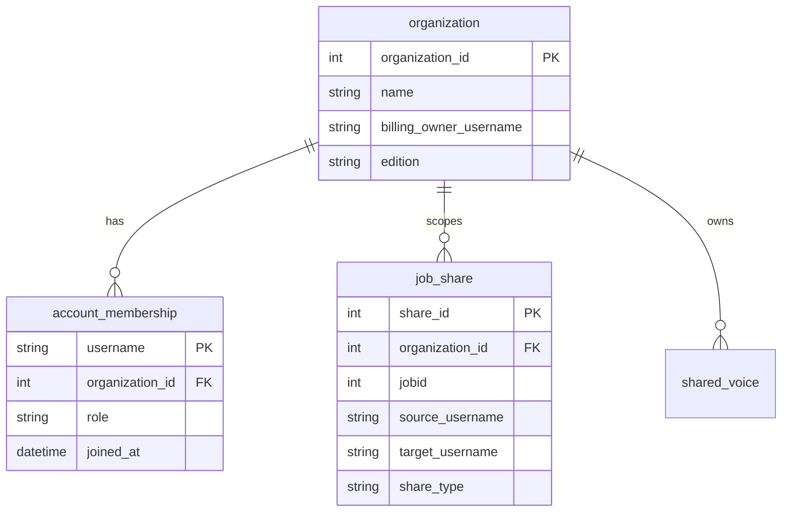

# Schéma organisation Agilotext (P3)

**Date :** 10 septembre 2026  
**Statut :** spec, **pas** d’implémentation. Après P1 (copie job) et P2 (page `/share`).  
**Voix :** réutilise [`../voice-enrollment/GUIDE_NICOLAS_SHARE_VOICES_ORG.md`](../voice-enrollment/GUIDE_NICOLAS_SHARE_VOICES_ORG.md).

Memberstack Teams = **facturation** (`OWNER` / `MEMBER`).  
Organisation Agilotext = **visibilité** et rôles métier. Un client peut avoir plusieurs sièges **sans** team MS (cas Jonquières).

---

## Entités

`share_type` : `copy` (P1 duplicate) | `org_visible` (vue espace, plus tard).

---

## Rôles applicatifs (V1)

| Rôle | Droits |
|------|--------|
| `admin_org` | Invite / retire des membres, voit l’espace, gère voix partagées |
| `collaborator` | Crée ses jobs, envoie une copie P1, partage un lien P2 |
| `viewer` | Lecture seule des jobs partagés à l’org |

Pas de mapping 1:1 avec Memberstack `OWNER`/`MEMBER`.

---

## Endpoints (plus tard)

| Endpoint | Description |
|----------|-------------|
| `createOrganization` | Admin ops ou billing owner |
| `getOrganizationMembers` | Liste username + rôle |
| `addOrganizationMember` | Rattacher un email déjà inscrit |
| `setOrganizationRole` | admin_org seulement |
| `getOrganizationJobs` | Jobs visibles selon rôle (hors V1 P1) |

---

## Pilote EHPAD Jonquières (ops, quand l’API existe)

Ne **pas** rattacher aujourd’hui dans Memberstack. Quand P3 est en prod :

| Siège | Rôle proposé |
|-------|-------------|
| Admissions (Karine) | `collaborator` |
| Qualité | `collaborator` |
| GRH | `collaborator` |
| Un référent contrat | `admin_org` |

Org name : `EHPAD intercommunal de Jonquières-Courthézon`.

---

## Hors scope P3 V1

- Fusionner les historiques en un seul inbox sans copie.
- Changer Stripe / Memberstack Teams.
- Firebase.
- Promettre une date au client.
