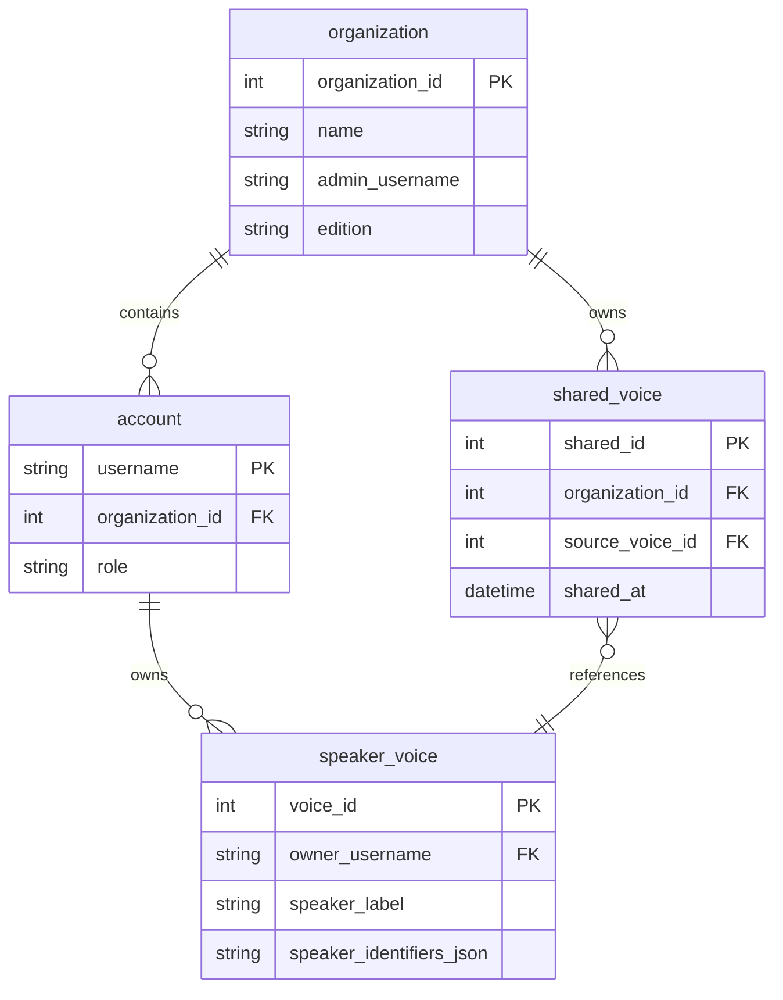

# Guide Nicolas — Partage d'empreintes vocales entre comptes / organisation

**Date :** 18 juin 2026  
**Contexte :** retour cliente Clarence (réunion 18/06) — voix enregistrées sur le compte admin (Muriel) non visibles sur les comptes collègues  
**Front :** [`scripts/pages/settings/voice-enrollment-settings.js`](../../scripts/pages/settings/voice-enrollment-settings.js)  
**Pages :** `/app/{free|premium|business}/voice` (dédiée, voice22) · `/app/*/profile` (legacy tab Profil)

---

## Problème produit

1. **Court terme (contourné côté front voice21)** : un admin peut enregistrer plusieurs voix sur son propre compte lors d'une réunion physique.
2. **Long terme (backend requis)** : les voix enregistrées sur le compte admin doivent être **réutilisables** par les autres comptes de l'entité (ex. Clarence, autres utilisateurs Pro/Business du même client).

Aujourd'hui, chaque `speaker_voice` est rattachée à un seul `username`. Aucun mécanisme de partage ou de duplication côté API publique.

---

## Horizon 1 — Court terme : endpoint admin de duplication

Endpoint opéré **uniquement par Agilotext** (support / ops), pas exposé aux utilisateurs finaux.

### `POST /api/v1/adminDuplicateSpeakerVoice`

**Authentification (obligatoire) :**

| Mesure | Détail |
|--------|--------|
| Admin token séparé | Token dédié ops, **distinct** du `getToken` utilisateur |
| IP whitelist | Seules les IPs Agilotext autorisées |
| Audit log | Qui a dupliqué quoi vers qui, quand (obligatoire) |
| Rate limit | Max 50 duplications / heure / admin |

**Paramètres (`application/x-www-form-urlencoded`) :**

| Param | Description |
|-------|-------------|
| adminUsername | Email admin Agilotext |
| adminToken | Token admin (≠ token utilisateur) |
| sourceVoiceId | ID voix source |
| sourceUsername | Email du compte source |
| targetUsername | Email du compte cible |
| targetEdition | Edition du compte cible (`pro`, `ent`, …) |

**Réponse OK :**

```json
{
  "status": "OK",
  "newVoiceId": 42,
  "targetUsername": "collegue@entreprise.com",
  "sourceVoiceId": 7
}
```

**Erreurs :**

| Code | Quand |
|------|-------|
| `error_admin_not_authorized` | Token admin invalide ou IP non whitelistée |
| `error_source_voice_not_found` | Voix source absente |
| `error_target_user_not_found` | Compte cible inexistant |
| `error_target_quota_reached` | Quota voix du compte cible atteint |

**Comportement attendu :**

- Copie des métadonnées (`speakerLabel`, `firstName`, `lastName`, `speakerIdentifiersJson`)
- Copie ou référence du fichier audio source (selon implémentation stockage)
- La voix dupliquée apparaît dans `getSpeakerVoices` du compte cible
- Entrée audit log avec `adminUsername`, `sourceVoiceId`, `targetUsername`, timestamp

**Cas d'usage ops :** client Clarence — Muriel a enregistré N voix sur son compte ; duplication manuelle vers les comptes individuels des collègues.

---

## Horizon 2 — Long terme : modèle organisation

### Schéma data proposé



### Endpoints supplémentaires

| Endpoint | Description |
|----------|-------------|
| `getOrganizationSpeakerVoices(username, token, edition)` | Toutes les voix disponibles (propres + partagées orga) |
| `shareVoiceWithOrganization(username, token, voiceId)` | Admin orga — partage une voix |
| `unshareVoice(username, token, sharedId)` | Admin orga — retire un partage |
| `getOrganizationMembers(username, token)` | Liste des comptes de l'organisation |

### Permissions

| Rôle | Lire voix orga | Partager voix | Retirer partage | Supprimer voix orga |
|------|----------------|---------------|-----------------|---------------------|
| admin | oui | oui | oui | oui |
| member | oui | non | non (sauf ses propres) | non |

### Impact pricing (à confirmer)

- Facturation par compte (actuelle) ou par seat orga ?
- Quota voix par orga ou cumulé par compte ?

### Impact Speechmatics

Les `speakerIdentifiersJson` sont déjà unitaires par voix. Le partage orga = lookup multi-compte côté Agilotext, **sans changement** côté Speechmatics.

---

## Phase 2 front (voice22) — critères de déclenchement

Le wizard guidé « Configurer plusieurs voix » **n'est pas prévu immédiatement**. Déclenchement uniquement si :

1. Clarence (ou client similaire) revient avec friction sur le batch simple voice21, **ou**
2. ≥ 2 autres clients demandent le même besoin via support, **ou**
3. Taux d'utilisation du batch < 30 % des admins multi-voix sur 2 semaines (signal PostHog `voice_enrollment_succeeded` avec `batch_active: true`)

Spec détaillée voice22 à rédiger séparément si l'un de ces critères est rempli.

---

## Analytics front (voice21)

PostHog (si présent sur la page) :

```javascript
posthog.capture('voice_enrollment_succeeded', {
  batch_active: boolean,
  batch_count: number,
  edition: string
});
```

---

## Recette ops (horizon 1)

1. Muriel a 5 voix sur son compte Business
2. Appel `adminDuplicateSpeakerVoice` × 5 vers le compte de Clarence
3. Clarence ouvre Mon compte → `getSpeakerVoices` liste les 5 voix
4. Transcription avec diarisation → identification correcte des speakers
5. Tentative duplication vers compte quota plein → `error_target_quota_reached`
6. Tentative sans admin token → `error_admin_not_authorized`

---

## Liens

- Audio playback (prérequis UX liste voix) : [`GUIDE_NICOLAS_GET_SPEAKER_VOICE_AUDIO.md`](GUIDE_NICOLAS_GET_SPEAKER_VOICE_AUDIO.md)
- Invitations email : [`GUIDE_NICOLAS_GET_SPEAKER_VOICE_INVITES.md`](GUIDE_NICOLAS_GET_SPEAKER_VOICE_INVITES.md)
